# postgres-patroni

PostgreSQL high availability implemented by Patroni, etcd for the distributed configuration store, HAProxy for load balancing, pgBackRest for backup/restore and PgBouncer for connection pooling.



## Environment variables

Use `.env.example` as a starting point:

```bash
cp .env.example .env
```

Prefix-based secret values are supported for all sensitive vars:

- ssm:/path: Fetch from AWS SSM Parameter Store (with decryption)
- file:/path: Read from a file (e.g., Docker secret)
- value:raw: Literal value
- raw without prefix: Treated as a literal value

### Required

- CLUSTER: Cluster name used by Patroni and pgBackRest.
- CA_ROOT_CERT, CA_ROOT_KEY: Root CA certificate/key contents provided via prefixes above. Typical via Docker secrets:
  - `CA_ROOT_CERT=file:/run/secrets/ca_root_cert`
  - `CA_ROOT_KEY=file:/run/secrets/ca_root_key`
  You can generate them with `gen-ca` sub-project (see `gen-ca/README.md`).

### Certificates

- CERT_C, CERT_ST, CERT_L, CERT_O, CERT_OU: Subject fields for service certificates.
- CERT_CN: Common Name; defaults to the container hostname if unset.
- CERT_EXPIRY: Certificate validity in cfssl duration format. Default `8760h` (1 year).
- CERT_KEY_ALGO: `ecdsa` or `rsa`. Default `ecdsa`.
- CERT_KEY_SIZE: If `ecdsa` -> `256`/`384`/`521`; if `rsa` -> `2048`/`3072`/`4096`.

### etcd

- ETCD_HOSTS: Comma-separated etcd client endpoints (default matches `compose.yaml`).
- ETCD_INITIAL_CLUSTER_TOKEN: Token via prefix value, e.g. `value:token`, `file:/run/secrets/etcd_initial_cluster_token`, or `ssm:/prod/etcd/cluster-token`.

### HAProxy

- TARGETS: Backend targets, typically the PgBouncer ports of Postgres nodes (e.g., `pg_01:6432,pg_02:6432`).

### Postgres + PgBouncer Authentication

- POSTGRES_SU_USER, POSTGRES_SU_PWD
- POSTGRES_REPL_USER, POSTGRES_REPL_PWD
- POSTGRES_REWIND_USER, POSTGRES_REWIND_PWD
Use prefixes for passwords, e.g. `file:/run/secrets/postgres_su_password` or `ssm:/prod/db/postgres/su_password`.

### Shared Buffers

- PG_SHARED_BUFFERS: PostgreSQL `shared_buffers` setting (for example `25%` of
available memory)

Huge pages are recommended for larger shared buffer sizes. The `vm.nr_hugepages`
kernel parameter should be set to at least the required number of pages for PostgreSQL.
Query the required number of huge pages with:

```sql
select * from pg_settings where name in ('shared_memory_size', 'shared_memory_size_in_huge_pages');
```

e.g. for POSTGRES_SHARED_BUFFERS=1250MB the shared memory size could be 1318MB
which requires 659 huge pages of 2MB.

Set the `vm.nr_hugepages` value on the host system with:

```
sudo sysctl -w vm.nr_hugepages=XXX
echo "vm.nr_hugepages=XXX" >>/etc/sysctl.conf
```

If the cluster is already setup the Patroni configuration will need to be updated
with any new shared buffers size.

```sh
patronictl edit-config

# add or update the shared_buffers: XXX line under the postgresql > parameters section
# save and exit the editor

patronictl restart <CLUSTER>
```

Verify that PostgreSQL is using huge pages with:

```sql
select * from pg_settings where name in ('huge_pages_status');
```

### pgBackRest Backup

- BACKUP_NAME: Defaults to `CLUSTER` if unset.
- BACKUP_REGION, BACKUP_PATH: S3 region and bucket/path via prefixes.
- BACKUP_ACCESS_KEY, BACKUP_SECRET_KEY: Credentials via prefixes (optional with instance profile).

### pgBackRest Restore

- RESTORE_NAME: Defaults to `CLUSTER` if unset.
- RESTORE_REGION, RESTORE_PATH: S3 region and path for restore via prefixes.
- RESTORE_ACCESS_KEY, RESTORE_SECRET_KEY: Credentials via prefixes (optional with instance profile).

### Logical Dumps to S3

A lightweight per-database dump using `pg_dump -Fc`, streamed to S3. Only runs on the Patroni leader.

- DUMP_PATH: Required. S3 destination, e.g. `s3://my-bucket/postgres-dumps`
- DUMP_REGION: Optional. AWS region; if omitted, AWS SDK defaults apply.
- DUMP_ACCESS_KEY, DUMP_SECRET_KEY: Optional. If omitted, the container uses its IAM role (instance profile/IRSA).
- DUMP_COMPRESSION: Optional. `pg_dump` compression level `0-9` (default `6`).
- DUMP_CRON: Optional. Cron schedule for automated dumps (e.g., `15 2 * * *`).

Output object key format:

- `<DUMP_PATH>/<CLUSTER>/<db>/<db>-YYYYMMDDTHHMMSSZ.dump`

Manual run inside the Patroni container:

- `postgres-dump-all`

Notes:

- If `DUMP_PATH` is not set, dumps are skipped.
- Dumps exclude template databases, owner/privilege statements.

## Running

- Set the required environment variables in `.env` or `compose.yaml`
- Ensure required secrets exist under `./secrets` as referenced above.
- Build and start the stack:

```bash
docker compose up --build
```

## Client Connections

- Postgres read/write connection to primary server: Docker Host `tcp/tls:5432` → HAProxy `tcp/tls:5432` → PgBouncer `tcp/ssl:6432` → Postgres `unix socket` on the primary server.
- Postgres read-only TLS connection to any server (primary or standby): Docker Host `tcp/tls:5433` → HAProxy `tcp/tls:5433` → PgBouncer `tcp/ssl:6432` → Postgres `unix socket` on any server.

## Replace an etcd member for an existing cluster

If the instance that runs a etcd member needs to be replaced (upgrade, failure)
then etcd member will need to be added back to the existing cluster. The
compose.yaml file expects the etcd cluster is a new cluster and will fail to add
the etcd member back to the cluster. The etcd container and volume needs to be
removed. The add-etcd-member-comppose.yaml file is a template for adding a member
back to an existing cluster. Use compose to start the add-etcd-member-comppose.yaml
and wait for the member to join the cluster. Then stop and remove the container
(not the volume) and start the original compose.yaml file.

The following commands illustrate the process:

```sh
docker stop etcd
docker rm etcd
docker volume rm etcd_data
docker compose -f add-etcd-member-compose.yaml up

# wait for member to join cluster

docker rm etcd
docker compose up
```
